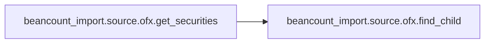
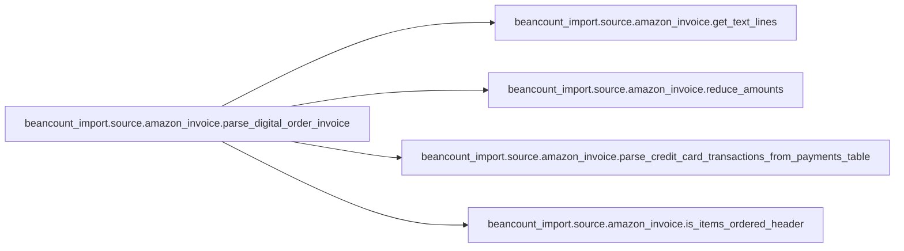

# Key Objects

[_Documentation generated by Documatic_](https://www.documatic.com)

<!---Documatic-section-beancount_import.source.ofx.get_securities-start--->
## beancount_import.source.ofx.get_securities

<!---Documatic-section-get_securities-start--->


### Object Calls

* beancount_import.source.ofx.find_child

<!---Documatic-block-beancount_import.source.ofx.get_securities-start--->
<details>
	<summary><code>beancount_import.source.ofx.get_securities</code> code snippet</summary>

```python
def get_securities(soup: bs4.BeautifulSoup) -> List[SecurityInfo]:
    seclistmsgsrsv = soup.find('seclistmsgsrsv1')
    if not seclistmsgsrsv:
        return []
    securities = []
    for secinfo in seclistmsgsrsv.find_all('secinfo'):
        uniqueid = find_child(secinfo, 'uniqueid')
        secname = find_child(secinfo, 'secname')
        ticker = find_child(secinfo, 'ticker')
        securities.append(SecurityInfo(uniqueid=uniqueid, name=secname, ticker=ticker))
    return securities
```
</details>
<!---Documatic-block-beancount_import.source.ofx.get_securities-end--->
<!---Documatic-section-get_securities-end--->

# #
<!---Documatic-section-beancount_import.source.ofx.get_securities-end--->

<!---Documatic-section-beancount_import.source.amazon_invoice.parse_digital_order_invoice-start--->
## beancount_import.source.amazon_invoice.parse_digital_order_invoice

<!---Documatic-section-parse_digital_order_invoice-start--->


### Object Calls

* beancount_import.source.amazon_invoice.get_text_lines
* beancount_import.source.amazon_invoice.reduce_amounts
* beancount_import.source.amazon_invoice.parse_credit_card_transactions_from_payments_table
* beancount_import.source.amazon_invoice.is_items_ordered_header

<!---Documatic-block-beancount_import.source.amazon_invoice.parse_digital_order_invoice-start--->
<details>
	<summary><code>beancount_import.source.amazon_invoice.parse_digital_order_invoice</code> code snippet</summary>

```python
def parse_digital_order_invoice(path: str, locale=Locale_en_US) -> Optional[Order]:
    errors = []
    with open(path, 'rb') as f:
        soup = bs4.BeautifulSoup(f.read(), 'lxml')
    logger.debug('check if order has been cancelled...')

    def is_cancelled_order(node):
        return node.text.strip() == locale.digital_order_cancelled
    if soup.find(is_cancelled_order):
        return None
    logger.debug('parsing header...')

    def is_digital_order_row(node):
        if node.name != 'tr':
            return False
        m = re.match(locale.digital_order, node.text.strip())
        if m is None:
            return False
        try:
            locale.parse_date(m.group(1))
            return True
        except:
            return False
    digital_order_header = soup.find(is_digital_order_row)
    digital_order_table = digital_order_header.find_parent('table')
    m = re.match(locale.digital_order, digital_order_header.text.strip())
    if m is None:
        msg = 'Identified digital order invoice but no digital orders were found.'
        logger.warning(msg)
        errors.append(msg)
        assert m is not None
    order_date = locale.parse_date(m.group(1))
    order_id_td = soup.find(lambda node: node.name == 'td' and re.match(locale.digital_order_id, node.text.strip()))
    m = re.match(locale.digital_order_id, order_id_td.text.strip())
    assert m is not None
    order_id = m.group(1)
    logger.debug('parsing items...')
    items_ordered_header = digital_order_table.find(lambda node: is_items_ordered_header(node, locale))
    item_rows = items_ordered_header.find_next_siblings('tr')
    items = []
    other_fields_td = None
    for item_row in item_rows:
        tds = item_row('td')
        if len(tds) != 2:
            other_fields_td = tds[0]
            continue
        description_node = tds[0]
        price_node = tds[1]
        price = price_node.text.strip()
        a = description_node.find('a')
        if a is not None:
            description = a.text.strip()
            url = a['href']
        else:
            bold_node = description_node.find('b')
            description = bold_node.text.strip()
            url = None
        text_lines = get_text_lines(description_node)

        def get_label_value(label):
            for line in text_lines:
                m = re.match('^\\s*' + label + ': (.*)$', line, re.UNICODE | re.DOTALL)
                if m is None:
                    continue
                return m.group(1)
        by = get_label_value(locale.digital_by)
        sold_by = get_label_value(locale.digital_sold_by)
        items.append(DigitalItem(description=description, by=by, sold_by=sold_by, url=url, price=locale.parse_amount(price)))
    other_fields_text_lines = get_text_lines(other_fields_td)
    logger.debug('parsing amounts...')

    def get_other_field(pattern, allow_multiple=False, return_label=False):
        """ Look for pattern in other_fields_text_lines
        """
        results = []
        for line in other_fields_text_lines:
            r = '^\\s*(' + pattern + ')\\s+(.*[^\\s])\\s*$'
            m = re.match(r, line, re.UNICODE)
            if m is not None:
                results.append((m.group(1).strip(':'), m.group(2)))
        if not return_label:
            results = [r[1] for r in results]
        if not allow_multiple:
            if not results:
                return None
            return results[0]
        return results

    def get_adjustments(pattern):
        adjustments = []
        for (label, amount_str) in get_other_field(pattern, allow_multiple=True, return_label=True):
            adjustments.append(Adjustment(amount=locale.parse_amount(amount_str), description=label))
        return adjustments

    def get_amounts_in_text(pattern_map):
        amounts = dict()
        for (key, label) in pattern_map.items():
            amount = locale.parse_amount(get_other_field(label))
            amounts[key] = amount
        return amounts
    items_subtotal = locale.parse_amount(get_other_field(locale.items_subtotal))
    total_before_tax = locale.parse_amount(get_other_field(locale.total_before_tax))
    tax = get_adjustments(locale.digital_tax_collected)
    total_for_this_order = locale.parse_amount(get_other_field(locale.digital_total_order))
    logger.debug('parsing pretax adjustments...')
    output_fields = dict()
    output_fields['pretax_adjustments'] = get_adjustments(locale.pretax_adjustment_fields_pattern)
    pretax_parts = [items_subtotal] + [a.amount for a in output_fields['pretax_adjustments']]
    expected_total_before_tax = reduce_amounts(pretax_parts)
    if expected_total_before_tax != total_before_tax:
        errors.append('expected total before tax is %s, but parsed value is %s' % (expected_total_before_tax, total_before_tax))
    logger.debug('parsing posttax adjustments...')
    output_fields['posttax_adjustments'] = get_adjustments(locale.posttax_adjustment_fields_pattern)
    posttax_parts = [total_before_tax] + [a.amount for a in tax] + [a.amount for a in output_fields['posttax_adjustments']]
    expected_total = reduce_amounts(posttax_parts)
    if expected_total != total_for_this_order:
        errors.append('expected total is %s, but parsed value is %s' % (expected_total, total_for_this_order))
    if locale.tax_included_in_price:
        tax = []
    shipment = Shipment(shipped_date=order_date, items=items, items_subtotal=items_subtotal, total_before_tax=total_before_tax, tax=tax, total=total_for_this_order, errors=errors, **output_fields)
    logger.debug('parsing payment information...')
    payment_table = soup.find(lambda node: node.name == 'table' and node.text.strip().startswith(locale.digital_payment_information))
    credit_card_transactions = parse_credit_card_transactions_from_payments_table(payment_table, order_date, locale=locale)
    logger.debug('...finished parsing digital invoice.')
    return Order(order_date=order_date, order_id=order_id, shipments=[shipment], credit_card_transactions=credit_card_transactions, pretax_adjustments=[], posttax_adjustments=output_fields['posttax_adjustments'], tax=None, errors=[])
```
</details>
<!---Documatic-block-beancount_import.source.amazon_invoice.parse_digital_order_invoice-end--->
<!---Documatic-section-parse_digital_order_invoice-end--->

# #
<!---Documatic-section-beancount_import.source.amazon_invoice.parse_digital_order_invoice-end--->

<!---Documatic-section-beancount_import.source.ofx.find_child-start--->
## beancount_import.source.ofx.find_child

<!---Documatic-section-find_child-start--->
<!---Documatic-block-beancount_import.source.ofx.find_child-start--->
<details>
	<summary><code>beancount_import.source.ofx.find_child</code> code snippet</summary>

```python
def find_child(node, name, conversion=None):
    child = node.find(name)
    if not child:
        return None
    if not child.contents:
        value = ''
    else:
        value = child.contents[0].strip()
    if conversion:
        value = conversion(value)
    return value
```
</details>
<!---Documatic-block-beancount_import.source.ofx.find_child-end--->
<!---Documatic-section-find_child-end--->

# #
<!---Documatic-section-beancount_import.source.ofx.find_child-end--->

<!---Documatic-section-beancount_import.list_balance_at_date.get_digits-start--->
## beancount_import.list_balance_at_date.get_digits

<!---Documatic-section-get_digits-start--->
<!---Documatic-block-beancount_import.list_balance_at_date.get_digits-start--->
<details>
	<summary><code>beancount_import.list_balance_at_date.get_digits</code> code snippet</summary>

```python
def get_digits(x):
    s = str(x)
    k = s.find('.')
    if k == -1:
        return 0
    return len(s) - k - 1
```
</details>
<!---Documatic-block-beancount_import.list_balance_at_date.get_digits-end--->
<!---Documatic-section-get_digits-end--->

# #
<!---Documatic-section-beancount_import.list_balance_at_date.get_digits-end--->

<!---Documatic-section-beancount_import.source.amazon_invoice.parse_regular_order_invoice-start--->
## beancount_import.source.amazon_invoice.parse_regular_order_invoice

```mermaid
flowchart LR
beancount_import.source.amazon_invoice.parse_regular_order_invoice-->beancount_import.source.amazon_invoice.parse_shipments
beancount_import.source.amazon_invoice.parse_shipments-->beancount_import.source.amazon_invoice.parse_shipment_payments
beancount_import.source.amazon_invoice.parse_shipment_payments-->beancount_import.source.amazon_invoice.get_field_in_table
beancount_import.source.amazon_invoice.parse_shipment_payments-->beancount_import.source.amazon_invoice.reduce_amounts
beancount_import.source.amazon_invoice.parse_shipment_payments-->beancount_import.source.amazon_invoice.get_adjustments_in_table
beancount_import.source.amazon_invoice.get_adjustments_in_table-->beancount_import.source.amazon_invoice.get_field_in_table
beancount_import.source.amazon_invoice.parse_shipments-->beancount_import.source.amazon_invoice.is_items_ordered_header
beancount_import.source.amazon_invoice.parse_regular_order_invoice-->beancount_import.source.amazon_invoice.get_adjustments_in_table
beancount_import.source.amazon_invoice.parse_regular_order_invoice-->beancount_import.source.amazon_invoice.reduce_amounts
beancount_import.source.amazon_invoice.parse_regular_order_invoice-->beancount_import.source.amazon_invoice.get_field_in_table
beancount_import.source.amazon_invoice.parse_regular_order_invoice-->beancount_import.source.amazon_invoice.add_amount
beancount_import.source.amazon_invoice.parse_regular_order_invoice-->beancount_import.source.amazon_invoice.parse_credit_card_transactions
beancount_import.source.amazon_invoice.parse_regular_order_invoice-->beancount_import.source.amazon_invoice.parse_gift_cards
beancount_import.source.amazon_invoice.parse_gift_cards-->beancount_import.source.amazon_invoice.parse_shipment_payments
beancount_import.source.amazon_invoice.parse_gift_cards-->beancount_import.source.amazon_invoice.is_items_ordered_header
beancount_import.source.amazon_invoice.parse_regular_order_invoice-->beancount_import.source.amazon_invoice.reduce_adjustments
beancount_import.source.amazon_invoice.reduce_adjustments-->beancount_import.source.amazon_invoice.reduce_amounts
beancount_import.source.amazon_invoice.parse_regular_order_invoice-->beancount_import.source.amazon_invoice.parse_credit_card_transactions_from_payments_table
```

<!---Documatic-section-parse_regular_order_invoice-start--->


### Object Calls

* beancount_import.source.amazon_invoice.parse_shipments
* beancount_import.source.amazon_invoice.get_adjustments_in_table
* beancount_import.source.amazon_invoice.reduce_amounts
* beancount_import.source.amazon_invoice.get_field_in_table
* beancount_import.source.amazon_invoice.add_amount
* beancount_import.source.amazon_invoice.parse_credit_card_transactions
* beancount_import.source.amazon_invoice.parse_gift_cards
* beancount_import.source.amazon_invoice.reduce_adjustments
* beancount_import.source.amazon_invoice.parse_credit_card_transactions_from_payments_table

<!---Documatic-block-beancount_import.source.amazon_invoice.parse_regular_order_invoice-start--->
<details>
	<summary><code>beancount_import.source.amazon_invoice.parse_regular_order_invoice</code> code snippet</summary>

```python
def parse_regular_order_invoice(path: str, locale=Locale_en_US) -> Order:
    errors = []
    with open(path, 'rb') as f:
        soup = bs4.BeautifulSoup(f.read(), 'lxml')
    logger.debug('parsing order id and order placed date...')
    title = soup.find('title').text.strip()
    m = re.fullmatch(locale.regular_order_id, title.strip())
    assert m is not None
    order_id = m.group(1)

    def is_order_placed_node(node):
        m = re.fullmatch(locale.regular_order_placed, node.text.strip())
        return m is not None
    node = soup.find(is_order_placed_node)
    m = re.fullmatch(locale.regular_order_placed, node.text.strip())
    assert m is not None
    order_date = locale.parse_date(m.group(1))
    logger.debug('parsing shipments...')
    shipments = parse_shipments(soup, locale=locale)
    if hasattr(locale, 'gift_card'):
        shipments += parse_gift_cards(soup, locale=locale)
    if len(shipments) == 0:
        msg = 'Identified regular order invoice but no items were found ' + '(neither shipments nor gift cards). This may be a new type. ' + 'Consider opening an issue at jbms/beancount-import on github.'
        logger.warning(msg)
        errors.append(msg)
    logger.debug('finished parsing shipments')
    logger.debug('parsing payment table...')
    payment_table_header = soup.find(lambda node: node.name == 'table' and re.match(locale.payment_information, node.text.strip()))
    payment_table = payment_table_header.find_parent('table')
    logger.debug('parsing pretax adjustments...')
    output_fields = dict()
    output_fields['pretax_adjustments'] = get_adjustments_in_table(payment_table, locale.pretax_adjustment_fields_pattern, locale=locale)
    pretax_amount = reduce_amounts((a.amount for a in output_fields['pretax_adjustments']))
    shipments_pretax_amount = None
    if any((s.pretax_adjustments for s in shipments)):
        shipments_pretax_amount = reduce_amounts((a.amount for shipment in shipments for a in shipment.pretax_adjustments))
        if shipments_pretax_amount != pretax_amount:
            errors.append('expected total pretax adjustment to be %s, but parsed total is %s' % (shipments_pretax_amount, pretax_amount))
    logger.debug('parsing posttax adjustments...')
    grand_total = locale.parse_amount(get_field_in_table(payment_table, locale.regular_total_order))
    payment_adjustments = collections.OrderedDict()
    payments_total_adjustments = []
    shipments_total_adjustments = []

    def resolve_posttax_adjustments() -> List[Adjustment]:
        """ Extract and compare posttax adjustments
        from shipment and payment tables.
        Returns list of reduced Adjustments.
        """
        payment_adjustments.update(reduce_adjustments(get_adjustments_in_table(payment_table, locale.posttax_adjustment_fields_pattern, assumed_currency=grand_total.currency, locale=locale)))
        all_shipments_adjustments = collections.OrderedDict(reduce_adjustments(sum((x.posttax_adjustments for x in shipments), [])))
        all_keys = collections.OrderedDict(payment_adjustments.items())
        all_keys.update(all_shipments_adjustments.items())
        all_adjustments = collections.OrderedDict()
        for key in all_keys:
            payment_amount = payment_adjustments.get(key)
            shipments_amount = all_shipments_adjustments.get(key)
            amount = payment_amount
            if payment_amount is None and shipments_amount is not None:
                amount = shipments_amount
                payments_total_adjustments.append(amount)
            elif payment_amount is not None and shipments_amount is None:
                shipments_total_adjustments.append(amount)
            elif payment_amount != shipments_amount:
                errors.append('expected total %r to be %s, but parsed total is %s' % (key, shipments_amount, payment_amount))
            all_adjustments[key] = amount
        return [Adjustment(k, v) for (k, v) in all_adjustments.items()]
    output_fields['posttax_adjustments'] = resolve_posttax_adjustments()
    logger.debug('consistency check taxes...')
    tax = locale.parse_amount(get_field_in_table(payment_table, locale.regular_estimated_tax))
    expected_tax = reduce_amounts((a.amount for shipment in shipments for a in shipment.tax))
    if expected_tax is None:
        if not locale.tax_included_in_price:
            shipments_total_adjustments.append(tax)
    elif expected_tax != tax:
        errors.append('expected tax is %s, but parsed value is %s' % (expected_tax, tax))
    if locale.tax_included_in_price:
        tax = None
    logger.debug('consistency check grand total...')
    payments_total_adjustment = reduce_amounts(payments_total_adjustments)
    shipments_total_adjustment = reduce_amounts(shipments_total_adjustments)
    expected_total = add_amount(shipments_total_adjustment, reduce_amounts((x.total for x in shipments)))
    if shipments_pretax_amount is None:
        expected_total = add_amount(expected_total, pretax_amount)
    adjusted_grand_total = add_amount(payments_total_adjustment, grand_total)
    if expected_total != adjusted_grand_total:
        errors.append('expected grand total is %s, but parsed value is %s' % (expected_total, adjusted_grand_total))
    logger.debug('parsing credit card transactions...')
    credit_card_transactions = parse_credit_card_transactions(soup, locale=locale)
    if not credit_card_transactions:
        logger.debug('no credit card transactions table given, falling back to payments table')
        credit_card_transactions = parse_credit_card_transactions_from_payments_table(payment_table, order_date, locale=locale)
    if credit_card_transactions:
        total_payments = reduce_amounts((x.amount for x in credit_card_transactions))
    else:
        logger.debug('no payment transactions found, assumig grand total as total payment amount')
        total_payments = grand_total
    if total_payments != adjusted_grand_total:
        errors.append('total payment amount is %s, but grand total is %s' % (total_payments, adjusted_grand_total))
    logger.debug('...finished parsing regular invoice.')
    return Order(order_date=order_date, order_id=order_id, shipments=shipments, credit_card_transactions=credit_card_transactions, tax=tax, errors=sum((shipment.errors for shipment in shipments), cast(Errors, [])) + errors, **output_fields)
```
</details>
<!---Documatic-block-beancount_import.source.amazon_invoice.parse_regular_order_invoice-end--->
<!---Documatic-section-parse_regular_order_invoice-end--->

# #
<!---Documatic-section-beancount_import.source.amazon_invoice.parse_regular_order_invoice-end--->

<!---Documatic-section-beancount_import.source.amazon_invoice.parse_credit_card_transactions-start--->
## beancount_import.source.amazon_invoice.parse_credit_card_transactions

<!---Documatic-section-parse_credit_card_transactions-start--->
<!---Documatic-block-beancount_import.source.amazon_invoice.parse_credit_card_transactions-start--->
<details>
	<summary><code>beancount_import.source.amazon_invoice.parse_credit_card_transactions</code> code snippet</summary>

```python
def parse_credit_card_transactions(soup, locale=Locale_en_US) -> Sequence[CreditCardTransaction]:

    def is_header_node(node):
        return node.name == 'td' and node.text.strip() == locale.credit_card_transactions
    header_node = soup.find(is_header_node)
    if header_node is None:
        return []
    sibling = header_node.find_next_sibling('td')
    rows = sibling.find_all('tr')
    transactions = []
    for row in rows:
        if not row.text.strip():
            continue
        tds = row('td')
        description = tds[0].text.strip()
        amount_text = tds[1].text.strip()
        m = re.match(locale.credit_card_last_digits, description, re.UNICODE)
        assert m is not None
        transactions.append(CreditCardTransaction(date=locale.parse_date(m.group(3)), card_description=m.group(1), card_ending_in=m.group(2), amount=locale.parse_amount(amount_text)))
    return transactions
```
</details>
<!---Documatic-block-beancount_import.source.amazon_invoice.parse_credit_card_transactions-end--->
<!---Documatic-section-parse_credit_card_transactions-end--->

# #
<!---Documatic-section-beancount_import.source.amazon_invoice.parse_credit_card_transactions-end--->

[_Documentation generated by Documatic_](https://www.documatic.com)